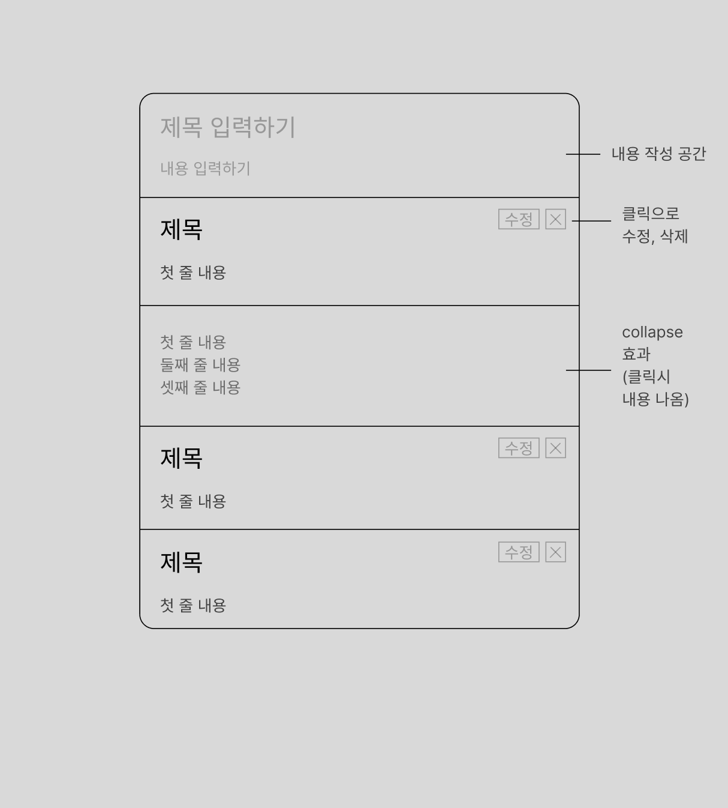

# browse_supabase
### layout



```javascript
// Post.js
export default function Post({ submitFunction }) {
    const [title, setTitle] = useState('');
    const [content, setContent] = useState('');

    const handleOnclickEvent = () => {
        submitFunction({ title: title, content: content })
        setTitle("")
        setContent("")
    }
    return (
        <div>
            <div style={inputDivStyle}>
                <input
                    style={inputTitleStyle}
                    value={title}
                    onChange={e => setTitle(e.target.value)}
                    placeholder="TITLE"
                />
                <textarea
                    style={inputContentStyle}
                    value={content}
                    onChange={e => setContent(e.target.value)}
                    placeholder="CONTENT"
                />
            </div>
            <button style={postButtonStyle} onClick={handleOnclickEvent}>POST</button>
        </div>
    )
}
// Main.js
export default function Main() {
    // ...
    const post = async (inputFromComponent) => {
        try {
            await supabase
                .from('newTable')
                .insert(inputFromComponent)
            fetchData()
        } catch (error) {
            console.error(error.message)
        }
    }
    // ...
    return (
        // ...
        <Post submitFunction={post} />
        // ...
    )
}
```

